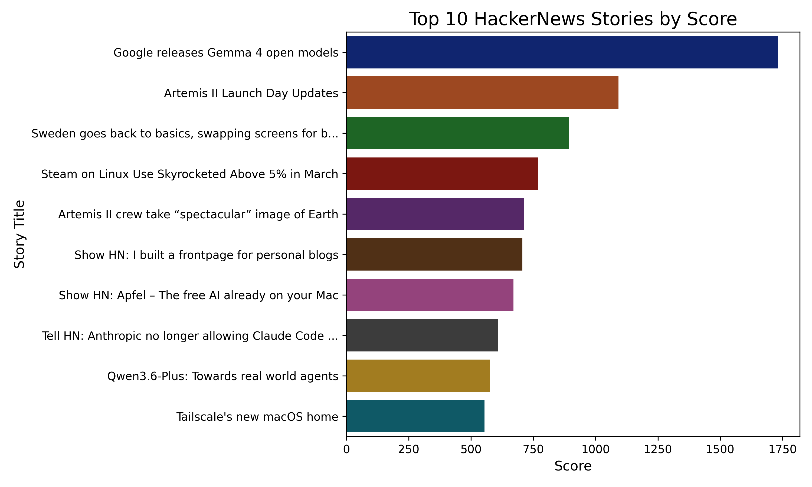
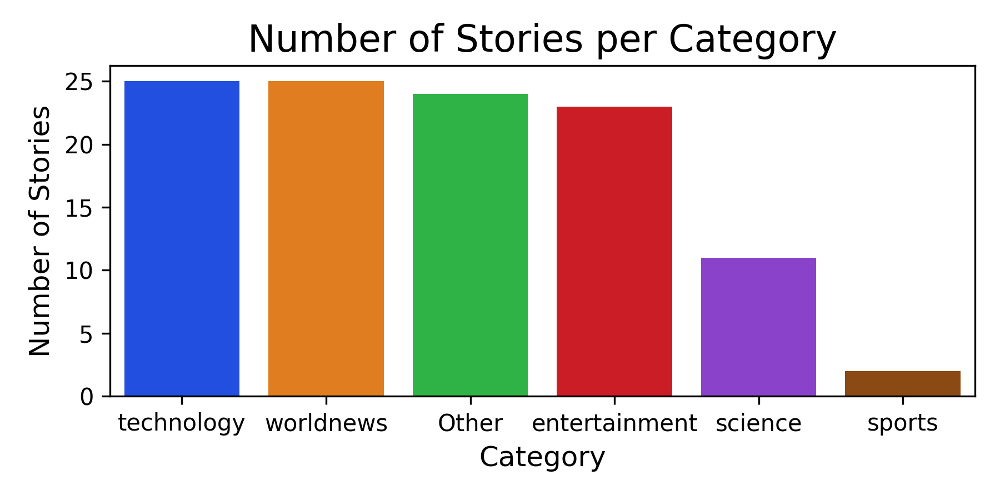
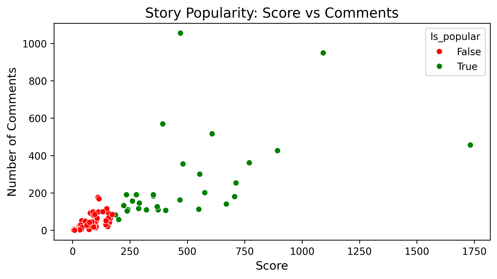
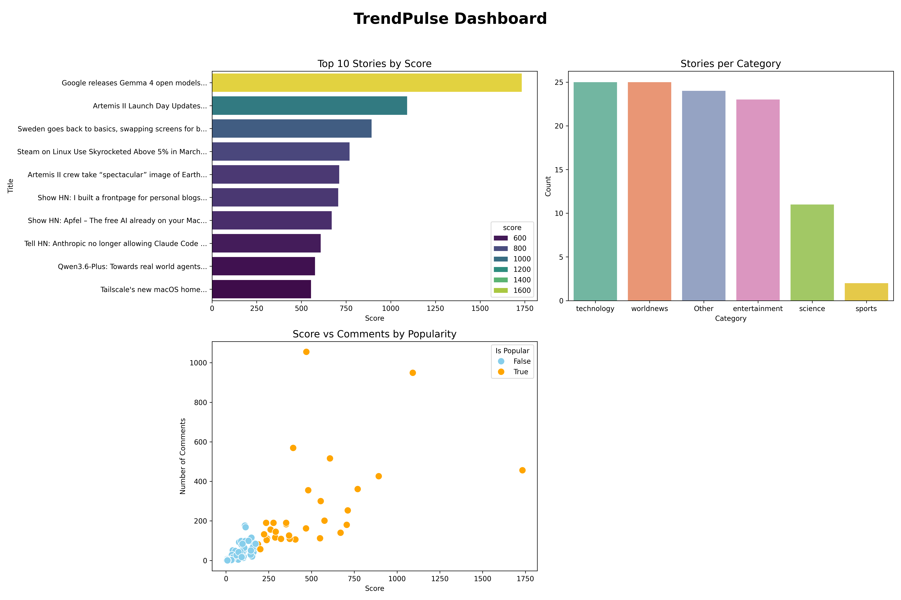

# TrendPulse — Task 4: Visualization Dashboard

**Author:** Parameswari Manthiramoorthi  
**Date:** 2026-04-05  

---

## Overview

Task 4 of the TrendPulse project focuses on creating **visualizations** from the **analysed trends dataset** generated in Task 3 (`trend_analysed.csv`).  
The goal is to provide insights into trending HackerNews stories across categories and engagement metrics through **three key charts**, combined into a **dashboard**.

---

## Input Data

- **Source:** `data/trend_analysed.csv` (output from Task 3)  
- **Columns used:**  
  - `Post_id`, `title`, `author`, `score`, `num_comments`, `category`, `collected_at`, `Engagement`, `Is_popular`

---

## Visualizations

1. **Top 10 Stories by Score** (Horizontal Bar Chart)  
   - Displays the highest scoring stories.  
   - Titles are truncated to 50 characters for readability.  
   - Color palette: `viridis`.

2. **Stories per Category** (Vertical Bar Chart)  
   - Shows the number of stories collected in each category.  
   - Color palette: `Set2`.

3. **Score vs Comments by Popularity** (Scatter Plot)  
   - Plots stories with `score` on the X-axis and `num_comments` on the Y-axis.  
   - Colors indicate popularity: `Is_popular = True` (orange), `False` (skyblue).  
   - Helps analyze engagement patterns.

---

## Dashboard Layout

- Combined all three charts into a single figure using `matplotlib` `gridspec`.  
- Layout:
  - **Top-left:** Top 10 stories by score  
  - **Top-right:** Stories per category  
  - **Bottom:** Scatter plot spanning full width  
- Added overall title: `"TrendPulse Dashboard"`  
- Saved as: `outputs/dashboard.png`

---

## Libraries Used

- `pandas` — Data manipulation  
- `matplotlib` — Plotting and layout  
- `seaborn` — Chart styling and color palettes  

---

